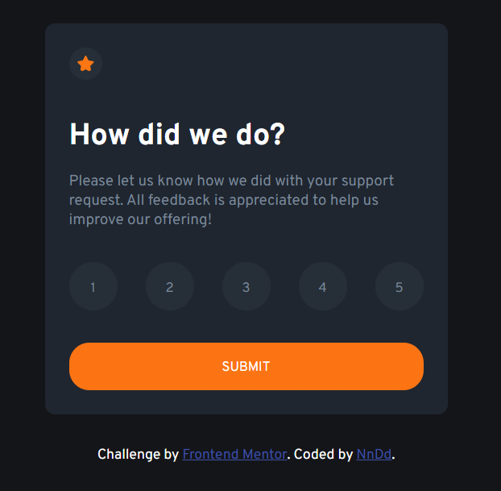
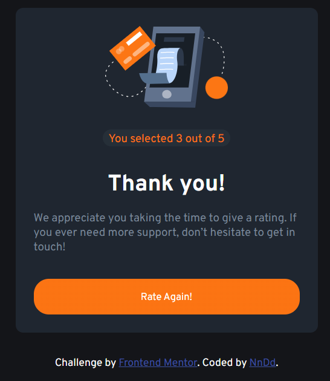

# Frontend Mentor - Interactive rating component solution

This is a solution to the [Interactive rating component challenge on Frontend Mentor](https://www.frontendmentor.io/challenges/interactive-rating-component-koxpeBUmI). Frontend Mentor challenges help you improve your coding skills by building realistic projects.

## Table of contents

- [Overview](#overview)
  - [The challenge](#the-challenge)
  - [Screenshot](#screenshot)
  - [Links](#links)
- [My process](#my-process)
  - [Built with](#built-with)
  - [What I learned](#what-i-learned)
- [Author](#author)


## Overview

### The challenge

Users should be able to:

- View the optimal layout for the app depending on their device's screen size
- See hover states for all interactive elements on the page
- Select and submit a number rating
- See the "Thank you" card state after submitting a rating

### Screenshot





### Links

- Solution URL: [Solution URL](https://github.com/Nn-Dd/Interactive-Rating_component)
- Live Site URL: [Live Site URL](https://nn-dd.github.io/Interactive-Rating_component/)

## My process

### Built with

- Semantic HTML5 markup
- CSS custom properties
- Flexbox
- Javascript

### What I learned

I learned a lot about JS

```js
const proudOfThisFunc = () => {
  console.log("🎉");
};
```

## Author

- GitHub profile - [Andy Jimenez | NnDd](https://github.com/Nn-Dd)
- Frontend Mentor - [@NnDD](https://www.frontendmentor.io/profile/Nn-Dd)
